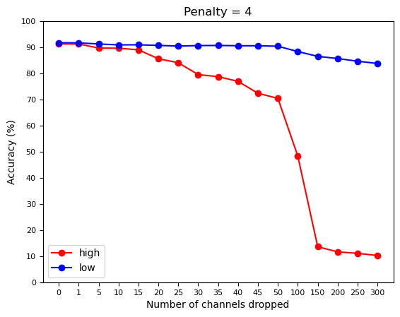

# Implementation of DECORE: Deep Compression with Reinforcement Learning

[Paper](https://openaccess.thecvf.com/content/CVPR2022/papers/Alwani_DECORE_Deep_Compression_With_Reinforcement_Learning_CVPR_2022_paper.pdf) (CVPR 2022)  

## Dependencies  
* Python3  
* PyTorch
* [NNI (Neural Network Intelligence)](https://nni.readthedocs.io/en/stable/)
* tqdm
* Matplotlib


## Contents

```prune_model.ipynb```: for pruning a model using DECORE.  
```investigate_policies.ipynb```: implementation of section 5 of the paper (Analysis: Does DECORE find important channels?).  
```agents.py```: contains the `Agent` class that handles interaction of agents with the network, and a function for attaching agents.  
```models.py```: just VGG16 for now. This is a modified VGG16, please refer to the paper for details.  
```training_utils.py```: training and validation functions.  
```best.pth.tar```: pretrained weights of VGG16 trained on CIFAR-10. 91.94% top-1 accuracy.


## Experiments

VGG16 trained on CIFAR-10  
Note: Percentage inside brackets is pruned rate.  
Note: DECORE-λ is DECORE with penalty λ.  
Note: For FLOPs and Params calculation, I've included all kinds of operations, not just convolution and linear. 

| Model           | Accuracy mine     | FLOPs mine | Params mine| Accuracy paper    | FLOPs paper   |  Params paper |
|:----------------|:-----------------:|:--------------:|:--------------:|:---------:|:-------------:|:-------------:|        
| VGG16           | 91.94             | 314.29M(0.0%)  | 14.99M(0.0%)   | 93.96%    | 313.73M(0.0%) | 14.98M(0.0%)  |  
| DECORE-50       | 91.48             | 242.05M(22.98%)| 11.91M(20.55%) | 91.68%    | 36.85M(88.3%) | 0.26M(98.3%)  |
| DECORE-4        | 89.41             | 43.41M(86.18%) | 2.01M(86.55%)  | -         | -             |   -           |

&nbsp;    
**Analysis: Does DECORE find important channels?**  


>To investigate the effect of learned policies on network compression, we reviewed policies of the VGG16 network trained on CIFAR10 for 200 epochs with 4,736 agents (just for convolution and linear layers). We didn’t train the network jointly in this experiment so that the analysis of learned policies is not mixed with network update. After training the agents, we remove the channels with high weight values and observe how much it changes the accuracy. If the model accuracy drops significantly without high weight channels, it suggests that the RL algorithm has correctly identified the most important channels in the net- work.  
>
> &mdash; <cite>Section 5 of the paper</cite>


   
## Citations

```bibtex
@inproceedings{alwani2022decore,
  title={DECORE: Deep Compression with Reinforcement Learning},
  author={Alwani, Manoj and Wang, Yang and Madhavan, Vashisht},
  booktitle={Proceedings of the IEEE/CVF Conference on Computer Vision and Pattern Recognition},
  pages={12349--12359},
  year={2022}
}
```
